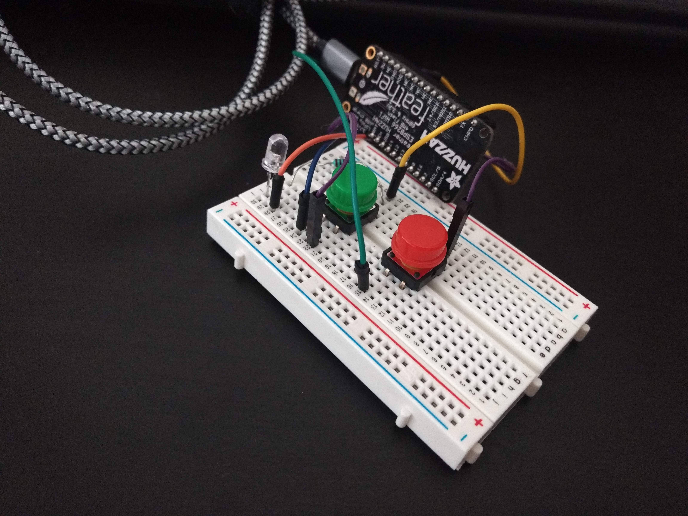
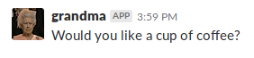

# Grandma

How does she do that?

Using a [MicroPython](https://micropython.org/) board, humans can press the green button when the coffee is done or the red button when the coffee is over.



If the coffee is done, Grandma will post on your favorite Slack channel a notification about it.



If someone press the button again in less than 20 minutes, she will not send messages to avoid spam. For now, she will not let you know when the coffee is over but soon you will be able to ask her about it.

For this project I'm using an [ESP 8266](https://learn.adafruit.com/adafruit-huzzah-esp8266-breakout/overview). Under the hood when a button is pressed a new request to the API saying if the coffee is done or over.


## Running

First things first: your need a Slack Bot with permissions to publish messages. Go to [Slack APPs](https://api.slack.com/apps), create one and come back.

That said, make sure your file `.env` is updated with all the environment variables needed:

```
export SLACK_BOT_TOKEN='xxx'
export DEFAULT_CHANNEL='random'
export AMPY_PORT=/dev/tty.SLAB_USBtoUART
```

Run `source .env` to load on your environment. After it, run `make install` to install the dependencies. You may run `make test` or `pytest` to make sure everything is ok.

This project is divided in two: board and server. In the **board** module all the code related to MicroPython. In the **server** package the API and the bot code.

### Server

We need to store the coffee memory somewhere, right? Let's init the db:

```
make init-db
```

Now it's time to spin it up the API:

```
make run
```

It will be available on [http://localhost:5000/](http://localhost:5000/). We just ran a simple API with three endpoints:

- [/](http://localhost:5000/)
- [/coffee/done](http://localhost:5000/coffee/done)
- [/coffee/over](http://localhost:5000/coffee/over)

The home (`/`) will list all the coffees that Grandma did. The other endpoints will be available to the board updates when the coffee is done or over.

### Pyboard

Before we get started with the board code, you must update the file `grandma/board/access.py ` with the secrets of your API and network. The boards needs the network credentials in order to be in the same network as the API.

```
API_URL = '192.168.0.24'  # be careful it may change
API_PORT = 5000
NETWORK_NAME = 'yyyy'
NETWORK_PASSWORD = 'xxxxxx'
```

To keep it running as soon as it is connected to an energy source, run `make deploy-to-board`. This command will copy the needed files into the board.

If you'd like running it from your machine:

```
ampy run -n grandma/board/board.py
```

### All together!

Ok, let's say everything went fine so far. To test it, press one of the buttons and check the logs. Would look like this:

```
FLASK_APP=grandma/server/main.py flask run  --host=0.0.0.0
 * Serving Flask app "grandma/server/main.py"
 * Environment: production
   WARNING: Do not use the development server in a production environment.
   Use a production WSGI server instead.
 * Debug mode: off
sqlite:////home/ana/workspace/grandma/grandma.db
 * Running on http://0.0.0.0:5000/ (Press CTRL+C to quit)
192.168.0.33 - - [16/Sep/2018 16:05:40] "GET /coffee/done HTTP/1.0" 200 -
INFO:werkzeug:192.168.0.33 - - [16/Sep/2018 16:05:40] "GET /coffee/done HTTP/1.0" 200 -
192.168.0.33 - - [16/Sep/2018 16:05:41] "GET /coffee/over HTTP/1.0" 200 -
INFO:werkzeug:192.168.0.33 - - [16/Sep/2018 16:05:41] "GET /coffee/over HTTP/1.0" 200 -
```

### What comes next?

Well, the idea was having some smart bot to chat about the coffee. I've been doing some research on conversational APIs. I would say that Granny will get smarter soon. :)

## Troubleshooting

**API**

- SlackLoginError

```
Traceback (most recent call last):
  File "/Users/ana.gomes/.pyenv/versions/3.6.4/lib/python3.6/site-packages/slackclient/client.py", line 52, in rtm_connect
    self.server.rtm_connect(use_rtm_start=with_team_state, **kwargs)
  File "/Users/ana.gomes/.pyenv/versions/3.6.4/lib/python3.6/site-packages/slackclient/server.py", line 151, in rtm_connect
    raise SlackLoginError(reply=reply)
slackclient.server.SlackLoginError
```

You must set `SLACK_BOT_TOKEN` as environment variable.

**Board**

- Missing option "--port"

```
ampy run -n grandma/board.py
Usage: ampy [OPTIONS] COMMAND [ARGS]...

Error: Missing option "--port" / "-p".
```

You must set `AMPY_PORT` as environment variable like `AMPY_PORT=/dev/tty.SLAB_USBtoUART`. Or adding it as an argument:

```
ampy run -n grandma/board.py -p /dev/tty.SLAB_USBtoUART
```

_PS.: `-n` stands for `/ --no-output`_

- I pressed the button, the light is on and nothing happens...

Houston, we have a problem. Check the variable `API_URL` on `access.py`. Either you don't have it or the IP is wrong.

If the problem persists could be a MicroPython [issue that happens when reopening WiFi connection](https://github.com/micropython/micropython-esp32/issues/167). You may reset the board and check it again.
